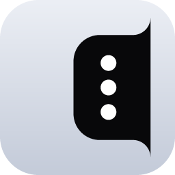
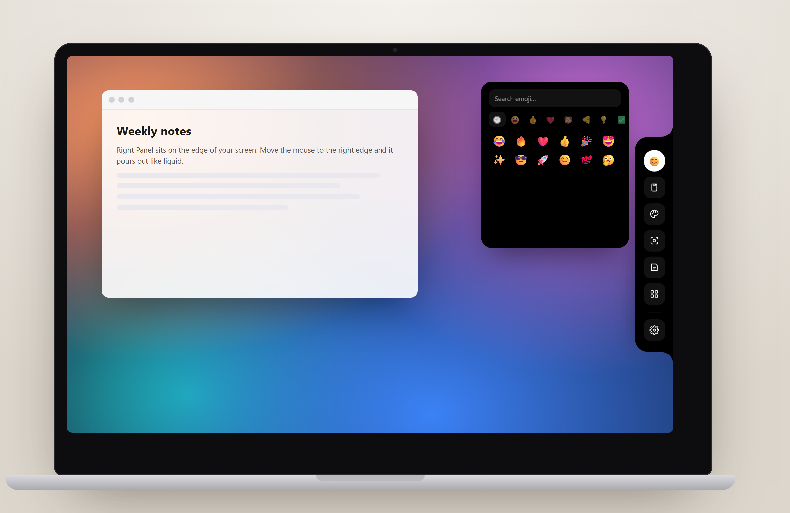
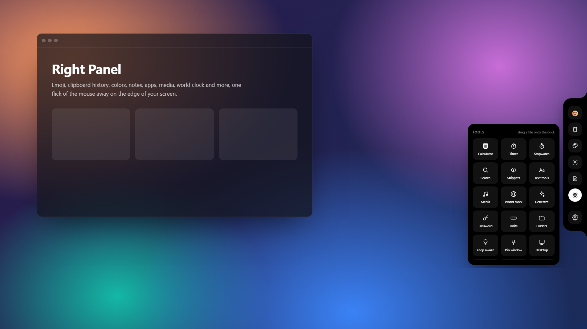

<div align="center">



# Right Panel

**A liquid side panel that lives on the edge of your screen.**<br>
Move your mouse to the right edge and it pours out: emoji, clipboard history, colors, notes, your apps and a dozen handy tools.

[](https://github.com/raminturne/right-panel/releases/latest)
[](https://github.com/raminturne/right-panel/releases)
[](https://github.com/raminturne/right-panel/actions)


<br>

<a href="https://github.com/raminturne/right-panel/releases/latest/download/RightPanel-Setup.exe"></a>
<a href="https://github.com/raminturne/right-panel/releases/latest/download/RightPanel-portable.exe"></a>
<a href="https://github.com/raminturne/right-panel/releases/latest/download/RightPanel-windows-x64.zip"></a>
<br>
<a href="https://github.com/raminturne/right-panel/releases/latest/download/RightPanel-macos-arm64.dmg"></a>
<a href="https://github.com/raminturne/right-panel/releases/latest/download/RightPanel-macos-x64.dmg"></a>
<a href="https://github.com/raminturne/right-panel/releases/latest/download/RightPanel-linux-amd64.deb"></a>
<a href="https://github.com/raminturne/right-panel/releases/latest/download/RightPanel-linux-x64.tar.gz"></a>

<br><br>



</div>

## Full screen



## Features

| | |
|---|---|
| 😊 **Emoji picker** | Search, categories, recents. Click to type it straight into the app you were using |
| 📋 **Clipboard history** | Text *and images*, search, ☆ pin favourites that survive restarts |
| 🎨 **Color** | Eyedropper (pick any pixel on screen), HEX / RGB / HSL, palette, recent colors |
| 📸 **Screenshot** | Opens the system snipping tool |
| 📝 **Notes** | As many notes as you like, in tabs, saved as you type |
| 🧩 **Your apps & folders** | Pin apps, shortcuts or folders — add them in Settings or just **drag them onto the panel** |
| 🔎 **Search** | Google, YouTube, Wikipedia, Translate, Maps, GitHub… or just type a URL |
| ✂️ **Snippets** | Save text you type often, paste it with one click |
| 🧮 **Calculator · Units · Password · Generate** | Quick math, unit conversions, strong passwords, UUIDs, dates, lorem ipsum |
| ⏱️ **Timer · Stopwatch · World clock** | With laps, presets and your favorite cities |
| 🎵 **Media** | Play/pause, next, previous, volume |
| 🔤 **Text tools** | UPPER/lower/Title, trim, one line, slug, Base64, URL encode, word count |
| ☀️ **Keep awake · Screen off · Lock · Pin window on top** | One-click system helpers |

**Also**
- **Drag a file or folder onto the panel** to pin it, or right-click it → *Add to Right Panel* (Windows; on Windows 11 under *Show more options*)
- **Left or right edge**, and pick which monitor it lives on (*Settings → General*)
- **Built-in updater**: Right Panel checks GitHub once a day and can download and run the new installer for you (*Settings → General*)
- Only one copy runs at a time

**Make it yours**
- Drag any tool **between the dock and the More grid**, reorder, hide or show it (also in *Settings → Widgets*)
- **15 themes** (Midnight, Graphite, Ocean, Grape, Forest, Wine, Espresso, Neon, Sunset, Snow, Sand, Sky, Rose, Mint, Lilac) + custom color
- Liquid spring animations, magnify-on-hover, sliding active pill
- Tray icon, start with Windows / at login

## Install

| Platform | File | Notes |
|---|---|---|
| **Windows 10/11** | `RightPanel-Setup.exe` | Recommended. Per-user install, no admin needed |
| | `RightPanel-portable.exe` / `.zip` | No install, just run it |
| **macOS 11+** *(beta)* | `RightPanel-macos-arm64.dmg` / `-x64.dmg` | Not notarized: right-click the app → **Open** the first time |
| **Linux** *(beta)* | `.deb` or `.tar.gz` | Needs WebKitGTK 4.1. Works on X11 and Wayland (runs through XWayland; `RIGHT_PANEL_BACKEND=wayland` opts out) |

Windows uses the built-in WebView2 runtime (already on Windows 10/11), which is why the app is under 1 MB.

### Beta notes for macOS and Linux
Core features work everywhere. A few are Windows-only for now and are hidden on other systems: *auto-paste into the previous app* (items are copied instead), *screen eyedropper*, *Pin window*, *Show desktop* and app icons. On Wayland (GNOME, KDE…) the app runs through XWayland so it can sit on the screen edge; the tray icon needs `libayatana-appindicator3-1`. Media keys on Linux use `playerctl` / `pactl`.

## Build from source

```bash
git clone https://github.com/raminturne/right-panel
cd right-panel
cargo build --release
```

Linux needs `libwebkit2gtk-4.1-dev libgtk-3-dev libx11-dev`. The Windows installer is built with [Inno Setup](https://jrsoftware.org/isinfo.php): `iscc installer/right-panel.iss`.

Built with Rust, [tao](https://github.com/tauri-apps/tao) + [wry](https://github.com/tauri-apps/wry). The whole UI is one HTML file: [`src/ui.html`](src/ui.html).

Settings live in `%APPDATA%\RightPanel` (Windows), `~/Library/Application Support/RightPanel` (macOS) or `~/.config/right-panel` (Linux).

## License

[MIT](LICENSE)
