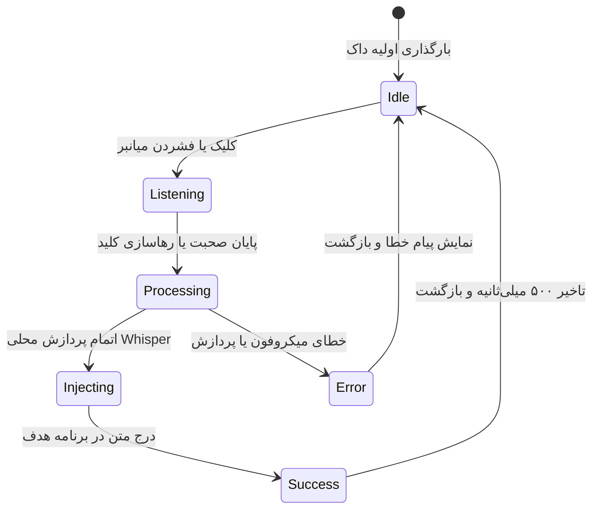

# Data Model: Unified Right Panel & Zero Ecosystem

## ۱. مدل موجودیت‌های اصلی (Core Entities)

### ۱.۱. تنظیمات یکپارچه (UnifiedSettings)
تنظیمات مرکزی ذخیره‌شده در `config.json` و همگام با دیتابیس:

```json
{
  "general": {
    "language": "fa",
    "edge": "right",
    "monitor_index": 0,
    "theme": "Midnight",
    "accent_color": "#3B82F6",
    "glass_blur": true,
    "auto_hide_dock": true,
    "autostart": true
  },
  "voice": {
    "stt_mode": "local",
    "active_model": "ggml-small.bin",
    "models_dir": "D:\\New folder (6)",
    "audio_feedback": true,
    "global_hotkey": "Ctrl + Shift + Z",
    "hotkey_mode": "toggle",
    "vad_threshold": 0.5,
    "audio_threads": 4,
    "llm_polish_mode": "off",
    "translate_mode": "off",
    "interactive_preview": false
  },
  "dock": {
    "widgets": [
      { "id": "voice_dictation", "name": "تایپ صوتی هوشمند", "enabled": true, "order": 0 },
      { "id": "clipboard", "name": "تاریخچه کلیپ‌بورد", "enabled": true, "order": 1 },
      { "id": "notes", "name": "یادداشت‌های سریع", "enabled": true, "order": 2 },
      { "id": "snippets", "name": "قطعه‌متن‌ها (Snippets)", "enabled": true, "order": 3 },
      { "id": "colors", "name": "انتخاب‌گر رنگ و قطره‌چکان", "enabled": true, "order": 4 },
      { "id": "tools", "name": "ابزارهای رومیزی", "enabled": true, "order": 5 },
      { "id": "settings", "name": "تنظیمات یکپارچه", "enabled": true, "order": 6 }
    ]
  }
}
```

---

### ۱.۲. یادداشت‌های یکپارچه (Note)
مدل ذخیره‌شده در جدول `notes` دیتابیس SQLite:

| فیلد | نوع داده | توضیحات |
|---|---|---|
| `id` | `TEXT PRIMARY KEY` | شناسه یکتای رشته‌ای (UUID / نانوآیدی) |
| `title` | `TEXT NOT NULL` | عنوان یادداشت (پیش‌فرض: سطر اول متن) |
| `body` | `TEXT NOT NULL` | متن کامل یادداشت |
| `tags` | `TEXT` | برچسب‌های تفکیک‌شده با کاما |
| `is_pinned` | `INTEGER NOT NULL` | نشانه‌گذاری برای نمایش دائمی در بالای لیست (0 یا 1) |
| `created_at` | `INTEGER NOT NULL` | زمان ایجاد بر حسب میلی‌ثانیه یونیکس |
| `updated_at` | `INTEGER NOT NULL` | آخرین زمان ویرایش |

---

### ۱.۳. قطعه‌متن‌های هوشمند (Snippet)
استفاده دوگانه: جایگزینی سریع با کلیک در پنل یا تایپ صوتی خودکار کلیدواژه:

| فیلد | نوع داده | توضیحات |
|---|---|---|
| `trigger_key` | `TEXT PRIMARY KEY` | عبارت محرک (مثلاً "ایمیل من") |
| `expansion_text` | `TEXT NOT NULL` | متن جایگزین نهایی (مثلاً "example@domain.com") |
| `category` | `TEXT` | دسته‌بندی موضوعی |
| `usage_count` | `INTEGER DEFAULT 0` | شمارش دفعات استفاده برای اولویت‌بندی نمایش |

---

### ۱.۴. تاریخچه کلیپ‌بورد و صوت (ClipboardHistoryItem)
| فیلد | نوع داده | توضیحات |
|---|---|---|
| `id` | `TEXT PRIMARY KEY` | شناسه رویداد |
| `item_type` | `TEXT NOT NULL` | نوع داده: `text` یا `image` یا `voice_transcription` |
| `content` | `TEXT` | متن ذخیره‌شده |
| `thumbnail_path` | `TEXT` | مسیر فایل تصویر بندانگشتی در صورت وجود تصویر |
| `is_pinned` | `INTEGER DEFAULT 0` | ذخیره ماندگار با پین‌کردن |
| `created_at` | `INTEGER NOT NULL` | زمان ثبت |

---

## ۲. ماشین وضعیت تایپ صوتی در داک (Voice State Machine)


