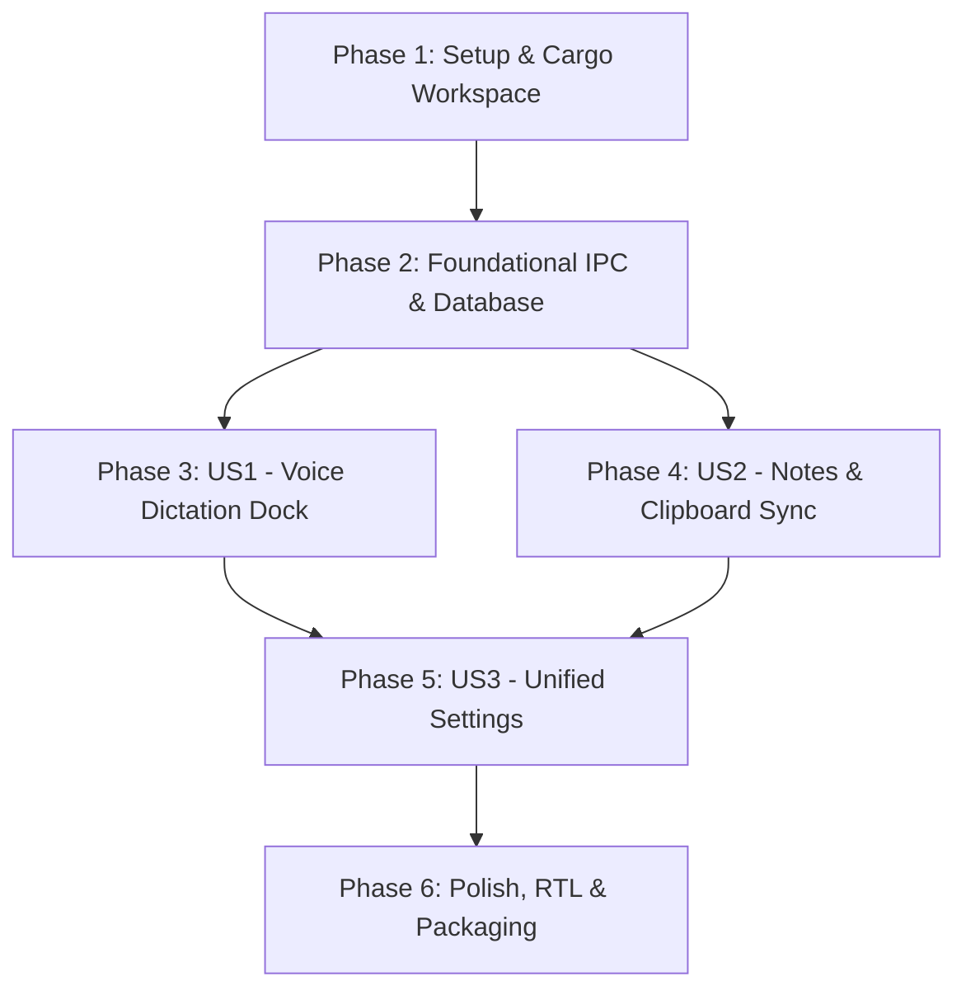

# Tasks: یکپارچه‌سازی پنل لبه صفحه (Right Panel) با اکوسیستم Zero

برنامه اجرایی گام‌به‌گام و قابل ردیابی برای ادغام و ارتقای مهندسی پنل لبه صفحه با دیمون و استودیوی Zero.

---

## Phase 1: Setup & Workspace Alignment (راه‌اندازی و یکپارچه‌سازی ساختار)

- [X] T001 پیکربندی ورک‌اسپیس Cargo ریشه در [Cargo.toml](file:///d:/zero-project/Cargo.toml) به منظور عضویت ماژول `right-panel-main` در ورک‌اسپیس یکپارچه پروژه.
- [X] T002 [P] تنظیمات وابستگی‌ها و همگام‌سازی کتابخانه‌های اشتراکی (`serde`, `serde_json`, `tokio`, `arboard`) در [right-panel-main/Cargo.toml](file:///d:/zero-project/right-panel-main/Cargo.toml).
- [X] T003 [P] افزودن فونت‌های فارسی استاندارد (`Vazirmatn`) و استایل‌های استاتیک محلی به [right-panel-main/assets/](file:///d:/zero-project/right-panel-main/assets).

---

## Phase 2: Foundational Infrastructure (زیرساخت‌های پایه‌ای و مشترک)

- [X] T004 ارتقای پروتکل IPC در [zero-daemon/src/ipc.rs](file:///d:/zero-project/zero-daemon/src/ipc.rs) برای پشتیبانی از پیام‌های وضعیت داک، ثبت نام در رویدادهای زنده صوتی، و پیام‌های تبادل داده یادداشت‌ها.
- [X] T005 [P] ارتقا و یکپارچه‌سازی جدول‌های دیتابیس SQLite در [zero-daemon/src/db.rs](file:///d:/zero-project/zero-daemon/src/db.rs) جهت نگه‌داری یادداشت‌ها (`notes`)، قطعه‌متن‌ها (`snippets`) و تاریخچه چندرسانه‌ای (`clipboard_history`).
- [X] T006 پیاده‌سازی کلاینت لوله نام‌گذاری‌شده ویندوز (`Named Pipe`) در [right-panel-main/src/main.rs](file:///d:/zero-project/right-panel-main/src/main.rs) برای برقراری ارتباط سریع و مداوم با `\\.\pipe\zero-ipc`.
- [X] T007 [P] افزودن مکانیزم بازنشانی خودکار اتصال (Auto-reconnect) و ثبت‌نام در رویدادهای انتشاری دیمون در [right-panel-main/src/main.rs](file:///d:/zero-project/right-panel-main/src/main.rs).

---

## Phase 3: User Story 1 (P1) - تایپ صوتی مستقیم از طریق داک کناری (Direct Voice Dictation)

* **هدف داستان:** کاربر با بردن ماوس به لبه مانیتور و کلیک روی داک (یا فشردن کلید میانبر)، صحبت می‌کند و متن فارسی بدون باز شدن هیچ پنجره اضافی مستقیماً در نرم‌افزار فعال تایپ می‌شود.
* **معیار پذیرش مستقل:** کلیک روی آیکون میکروفون در داک شروع ضبط را فعال کند، پالس فرکانس صوتی روی داک نشان داده شود، و متن نهایی در ویرایشگر فعال تزریق گردد.

- [X] T008 [US1] طراحی المان بصری کاشی صوتی هوشمند (Voice Tile) با انیمیشن‌های فیزیکی شناور در [right-panel-main/src/ui.html](file:///d:/zero-project/right-panel-main/src/ui.html).
- [X] T009 [US1] پیاده‌سازی تعامل کلیک و رویدادهای نگه‌داشتن (Toggle / Push-to-Talk) بر روی کاشی صوتی در [right-panel-main/src/ui.html](file:///d:/zero-project/right-panel-main/src/ui.html).
- [X] T010 [US1] هندل کردن دستورات `TriggerRecord` و مخابره وضعیت زنده ضبط بین وب‌ویو و هسته در [right-panel-main/src/main.rs](file:///d:/zero-project/right-panel-main/src/main.rs).
- [X] T011 [US1] اتصال دریافت رخداد `TranscriptionPreview` به پنل برای نمایش کپسول متنی زنده قبل از تزریق نهایی در [right-panel-main/src/ui.html](file:///d:/zero-project/right-panel-main/src/ui.html).
- [X] T012 [US1] تضمین تزریق دقیق متن به مکان‌نمای فعال سیستم‌عامل بدون دزدیدن فوکوس پنجره هدف در [zero-daemon/src/injector.rs](file:///d:/zero-project/zero-daemon/src/injector.rs).

---

## Phase 4: User Story 2 (P2) - دسترسی به تاریخچه، کلیپ‌بورد و یادداشت‌های سریع (History, Clipboard & Notes)

* **هدف داستان:** کاربر از طریق زبانه‌های پنل کناری بتواند تاریخچه متون صوتی، کپی‌های کلیپ‌بورد و یادداشت‌های چندگانه را مدیریت، جستجو و الصاق نماید.
* **معیار پذیرش مستقل:** متون صوتی گذشته در زبانه تاریخچه نمایش یابند؛ با کلیک کپی یا الصاق شوند و یادداشت‌ها در SQLite ذخیره و بازیابی گردند.

- [X] T013 [P] [US2] اتصال رابط یادداشت‌ها در [right-panel-main/src/ui.html](file:///d:/zero-project/right-panel-main/src/ui.html) به پیام‌های IPC دریافت و ذخیره یادداشت در دیمون.
- [X] T014 [US2] همگام‌سازی تاریخچه کلیپ‌بورد صوتی و متنی از دیتابیس مشترک دیمون در [right-panel-main/src/main.rs](file:///d:/zero-project/right-panel-main/src/main.rs).
- [X] T015 [P] [US2] افزودن فیلتر جستجوی فوق‌سریع و نشانه‌گذاری (Pin) یادداشت‌ها و کلیپ‌ها در [right-panel-main/src/ui.html](file:///d:/zero-project/right-panel-main/src/ui.html).
- [X] T016 [US2] افزودن زبانه قطعه‌متن‌های سریع (Snippets) به پنل لبه جهت جایگزینی سریع عبارات پرکاربرد در [right-panel-main/src/ui.html](file:///d:/zero-project/right-panel-main/src/ui.html).

---

## Phase 5: User Story 3 (P3) - مدیریت متمرکز تنظیمات (Unified Settings Sync)

* **هدف داستان:** تمامی تنظیمات صوتی Zero و تنظیمات ظاهری پنل لبه در یک پنل هماهنگ در دسترس باشد و هر تغییر فوراً بدون ریستارت اعمال شود.
* **معیار پذیرش مستقل:** تغییر مدل صوتی یا تغییر لبه داک (چپ/راست) در تنظیمات، بدون ریستارت برنامه فوراً اعمال گردد.

- [X] T017 [US3] ادغام گزینه‌های تنظیمات موتور صوتی (مدل، حالت استنتاج، کلید میانبر) در تب Settings فایل [right-panel-main/src/ui.html](file:///d:/zero-project/right-panel-main/src/ui.html).
- [X] T018 [US3] پیاده‌سازی پیام‌های تبادل تنظیمات `GetConfig` و `UpdateSettings` در [right-panel-main/src/main.rs](file:///d:/zero-project/right-panel-main/src/main.rs).
- [X] T019 [US3] اعمال بلادرنگ تغییرات کلید میانبر و مدل فعال در دیمون بدون قطع سرویس در [zero-daemon/src/config.rs](file:///d:/zero-project/zero-daemon/src/config.rs).

---

## Phase 6: Polish, RTL Aesthetics & Standalone Packaging (بهینه‌سازی، فارسی‌سازی و خروجی پرتابل)

- [X] T020 [P] بازطراحی کامل استایل‌های [right-panel-main/src/ui.html](file:///d:/zero-project/right-panel-main/src/ui.html) با جهت استاندارد `dir="rtl"`، تایپوگرافی شکیل وزیزمتن، و افکت‌های مدرن شیشه‌ای (Backdrop blur / Acrylic).
- [X] T021 [P] پیاده‌سازی منطق آینه‌ای (Mirror Layout) برای تطابق بی‌نقص جهت نمایش زیرمنوها هنگام قرارگیری داک در لبه سمت راست یا چپ مانیتور در [right-panel-main/src/ui.html](file:///d:/zero-project/right-panel-main/src/ui.html).
- [X] T022 بیلد بهینه‌شده ریلیز با پرچم‌های بهینه‌سازی حجم و سرعت (`opt-level = "z"`) با دستور `cargo build --release`.
- [X] T023 انتقال باینری نهایی `right-panel.exe`، دیمون و موتور پردازش به پوشه پرتابل [Zero-Studio-Portable/](file:///d:/zero-project/Zero-Studio-Portable).
- [X] T024 اجرای تست نهایی سناریوهای کاربری طبق [quickstart.md](file:///d:/zero-project/specs/001-unified-right-panel/quickstart.md) و اطمینان از عملکرد ۱۰۰٪ آفلاین و بدون پنجره اضافی.

---

## Dependencies & Execution Order (ترتیب وابستگی‌ها)

### فرصت‌های اجرای موازی (Parallel Execution):
* تسک‌های `T002` و `T003` در فاز ۱ می‌توانند همزمان اجرا شوند.
* تسک‌های `T004` و `T005` به صورت موازی در لایه دیمون قابل انجام هستند.
* تسک‌های مربوط به استایل و RTL (`T020` و `T021`) موازی با فرآیندهای کامپایل قابل پیاده‌سازی می‌باشند.

### محدوده محصول کمینه (MVP Scope):
* **تسک‌های فاز ۱ تا فاز ۳ (T001 الی T012):** اتصال داک کناری به لوله IPC دیمون Zero و افزودن دکمه میکروفون برای تایپ صوتی مستقیم بدون باز شدن هیچ پنجره اضافی.
