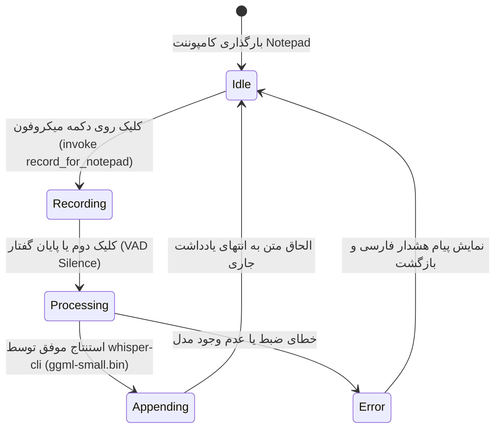

# Data Model: STT Notepad Integration, Right Panel Lifecycle & Golden Model

این سند مدل داده‌ها، ساختار پیام‌های IPC و تعاریف پیکربندی ویژگی `002-stt-notepad-rightpanel-hotkey` را تعریف می‌کند.

---

## ۱. توسعه ساختار پیکربندی مرکزی (`DaemonConfig`)

فایل ذخیره‌سازی: `%LOCALAPPDATA%\Zero\config.json` یا `config.json` پوشه پرتابل:

```json
{
  "stt_mode": "local",
  "active_model": "ggml-small.bin",
  "models_dir": "D:\\New folder (6)",
  "enable_right_panel": true,
  "hotkey": "Ctrl+Shift+Z",
  "hotkey_mode": "toggle",
  "engine_mode": "hybrid",
  "auto_submit": true,
  "auto_submit_key": "enter",
  "append_trailing_space": true,
  "audio_feedback": true,
  "vad_silence_timeout": 2.0
}
```

### فیلدهای کلیدی اضافه و تثبیت‌شده:

| نام فیلد | نوع داده | مقدار پیش‌فرض | توضیحات |
| :--- | :--- | :--- | :--- |
| `enable_right_panel` | `bool` | `true` | فعال یا غیرفعال بودن اجرای داک پنل لبه صفحه و راه‌اندازی خودکار آن |
| `stt_mode` | `String` | `"local"` | اولویت انتخاب موتور تشخیص گفتار (`local` / `cloud` / `browser`) |
| `active_model` | `String` | `"ggml-small.bin"` | نام فایل مدل پیش‌فرض برای استنتاج محلی فارسی |
| `models_dir` | `String` | `"D:\\New folder (6)"` | مسیر دایرکتوری فیزیکی ذخیره مدل‌های دانلودشده |

---

## ۲. مشخصات پیام‌های لایه IPC و دستورات Tauri

### دستورات جدید و اصلاح‌شده در Tauri (`zero-studio/src-tauri/src/main.rs`):

```rust
// استعلام وضعیت پروسه پنل کناری
#[tauri::command]
async fn is_right_panel_running() -> Result<bool, String>;

// فعال/غیرفعال‌سازی پنل کناری و ذخیره در کانفیگ دیمون
#[tauri::command]
async fn set_right_panel_enabled(enabled: bool) -> Result<bool, String>;

// راه‌اندازی دستی مجدد پنل کناری
#[tauri::command]
async fn start_right_panel() -> Result<bool, String>;

// توقف اجباری پروسه پنل کناری
#[tauri::command]
async fn stop_right_panel() -> Result<bool, String>;

// ضبط صوتی مستقیم و تزریق به دفتر یادداشت
#[tauri::command]
async fn record_for_notepad() -> Result<String, String>;
```

### پیام‌های پروتکل لوله نام‌گذاری‌شده (`\\.\pipe\zero-ipc`):

```json
// درخواست ضبط یادداشت
{"cmd": "record_for_notepad"}

// پاسخ بازگشتی با متن رونویسی‌شده
{"ok": true, "text": "متن شناسایی‌شده توسط مدل محلی"}
```

---

## ۳. ماشین وضعیت ضبط صوتی در دفتر یادداشت (Notepad Voice State Machine)


